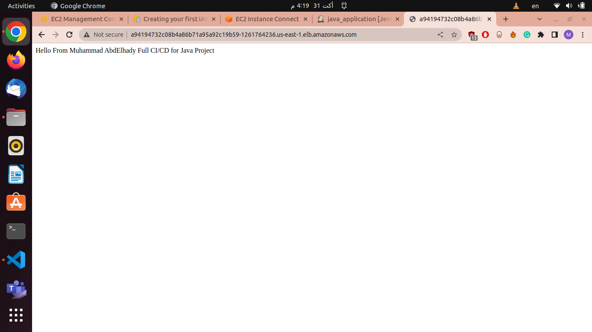

# CI-CD-Jave-Project-using-Jekins Pipeline

### Tools used in the project 
- Create 3 EC2 instance (Jenkins , SonarQube, Nexus)
- Using Maven plugin 
- Docker
- EKS Cluster on AWS
- Terraform
## CI/CD Pipeline

## use loadbalancer service to access app

